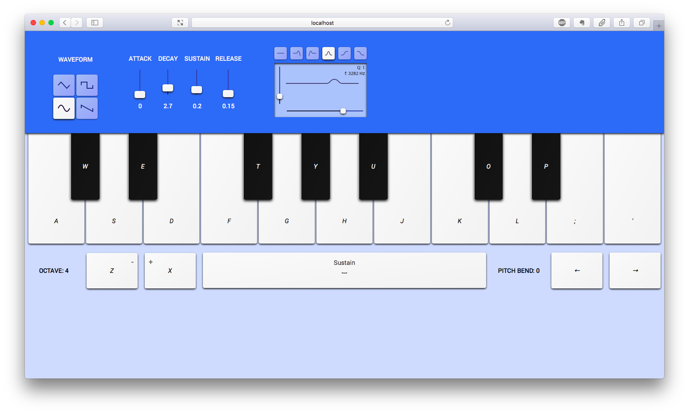

# React Synth

A musical-typing keyboard right in the browser. 

Open up React Synth and play chords and melodies right on your keyboard. Choose from 4 waveforms, modify the envelope or add a filter (in development).

React Synth uses [Tone.js](https://tonejs.github.io).

Currently still in development, and no demo is available.